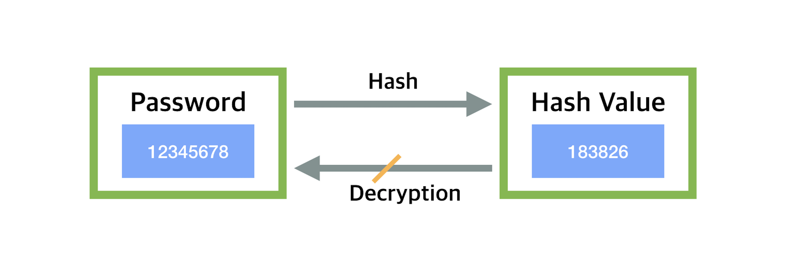
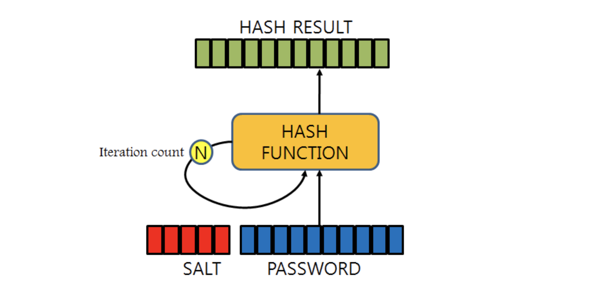

# 인증 
<b class='post-subtitle'>Authentication</b>
> 유저의 identification 을 확인하는 절차

회원가입과 로그인 절차에서 유저의 비밀번호를 데이터베이스에 저장하고 이를 확인하는 인증의 과정이 필요합니다. 이때 유저의 비밀번호를 그대로 데이터베이스에 저장할 경우, 해킹 시 비밀번호가 그대로 노출되며 내부 인력이 유저의 비밀번호를 조회할 가능성이 있습니다. 이처럼 비밀번호와 관련된 여러 가지 보안상 문제를 방지하기 위하여 암호화하여 저장하고 관리할 필요가 있고 법 규정[^1]으로 이를 강제하고 있습니다. 

먼저 회원가입과 로그인의 절차는,
1. 유저가 아이디와 비밀번호를 생성
2. 유저의 비밀번호를 암호화하여 데이터베이스에 저장
3. 유저가 아이디와 비밀번호를 입력
4. 비밀번호를 암호화한 후 데이터베이스에 저장된 암호화된 비밀번호와 비교 <l style='font-size:14px; color:#aaa'>(일치하면 로그인 성공)</l>
5. 로그인에 성공하면 ```access token```을 전송
6. 이후 모든 request에 ```access token```을 함께 전송 → 인가[^2]

위와 같은 순서로 진행됩니다. 위 과정에서 암호화와 토큰 발행 두 가지의 과정을 통해 인증과 인가를 진행합니다. 

<br>
# 비밀번호 암호화 
```해싱(Hashing)```과 ```암호화(Encryption)``` 둘 다 데이터 보안을 위해 사용됩니다. 비밀번호를 암호화하기 위하여 두 가지 방식을 비교해볼 때 가장 큰 차이점은 방향입니다. 
해시 함수는 **일방향 암호화**이며 복호화가 불가능하고 암호화는 **양방향 암호화**로 복호화가 가능합니다. 전자의 경우 주로 데이터의 노출을 막는 데 목적이 있고 후자는 서버와 브라우저의 통신에서 주고받는 데이터의 암호화에 목적을 두고 있습니다. **비밀번호의 경우 복호화되지 아니하도록 해시를 통해 일방향 암호화**를 합니다. 
- **일방향 알고리즘** : 복호화가 불가능하여 원래 데이터가 아닌 암호화된 데이터 값을 보여주는 방식. (SEED, ARIA, AES, RSA 등)
- **양방향 알고리즘** : 암호화를 수행하고 복호화하였을 때 평문 값으로 원래 데이터를 보여주는 방식. (SHA 등)  


<br>
## 일방향 해시 함수 (one-way hash function)
```bash
>>> import hashlib
>>> h = hashlib.sha256()
>>> h.update(b'test password')
>>> h.hexdigest()
'0b47c69b1033498d5f33f5f7d97bb6a3126134751629f4d0185c115db44c094e'

>>> h.update(b'test password 2')
>>> h.hexdigest()
'55192b4b915c37be114310c37e4736ecdc10117242574283d9aec75c0814542a'
```


해시 함수는 입력 값의 길이에 상관없이 고정된 길이의 해시 값(digest)을 생성합니다. 이때 입력 값이 일부만 변경되더라도 완전히 다른 해시 값을 출력합니다. 또한 위에서 언급하였듯이 복호화할 수 없습니다. 

<br>
### 해시 함수의 문제점
- Brute force attack (무차별 대입 공격) : 해시 함수의 본래 목적은 비밀번호 암호화가 아닌 짧은 시간에 데이터를 검색하기 위해 설계되었습니다. 이러한 특징 때문에 해커는 ```해킹할 대상의 digest```와 ```임의의 문자열의 digest```를 빠른 속도로 비교하여 비밀번호를 해킹할 수 있고 유저들이 보통 짧고 복잡하지 않은 비밀번호를 사용한다는 것을 노린 공격 기법입니다.
- Rainbow table attack : 미리 해시 값을 계산해 놓은 테이블을 ```Rainbow table```이라고 합니다. 임의의 문자열을 해싱하면 항상 같은 값이 나온다는 특징을 이용한 해킹 기법입니다. 수많은 문자열의 해시 값을 미리 계산해 DB화하여 Rainbow table을 만들고 해킹한 비밀번호를 Rainbow table의 해시 값들과 비교합니다. 유저들이 어렵지 않고 흔하게 쓰이는 비밀번호를 사용할 경우 해킹당할 위험이 크고 같은 비밀번호를 가진 다른 유저까지 해킹당할 위험이 있습니다.

### 해시 함수의 문제점 보완

- Key Stretching : 해싱된 digest를 한 번 더 해싱하고 그 결과 값을 또 한 번 더 해싱하고 이 과정을 여러 번 반복하여 Brute force attack을 방지하는 방법입니다. 
- Salting : 임의의 문자열 ```salt```를 사용자의 비밀번호에 덧붙여 해싱합니다. 비밀번호를 그대로 해싱한 digest와 salt를 덧붙인 digest는 완전히 다른 값이 되기 때문에 Rainbow table attack을 방지할 수 있습니다. 

### 해시 함수 종류
- PBKDF2 (Password-Based Key Derivation Function) : [Django](https://docs.djangoproject.com/en/2.2/topics/auth/passwords/)에서 기본으로 사용 중입니다. salt를 적용한 후 해시 함수의 반복 횟수를 지정할 수 있습니다.
- bcrypt : 처음부터 비밀번호 저장을 목적으로 설계되었고 Key Stretching과 Salting을 구현한 해시 함수입니다. 관련된 라이브러리도 언어별로 쉽게 찾아볼 수 있습니다. 
- scrypt : digest를 생성할 때 메모리 오버헤드를 갖도록 설계되어 brute force attack을 시도할 때 병렬화 처리가 매우 어렵습니다. 만약 구현하려는 시스템이 매우 민감한 정보를 다루고 보안 시스템을 구현하는 데 큰 비용을 투자할 수 있다면 사용합니다.

<br>
## Bcrypt
[bcrypt](https://ko.wikipedia.org/wiki/Bcrypt)는 단방향 암호화 해싱함수로 1999년 USENIX에서 발표되었습니다. 
```
$2b$[cost]$[22 character salt][31 character hash]
```
bcrypt의 해시 문자열은 위와 같은 형태로 출력됩니다. 

각 부분을 살펴보면 다음과 같습니다. 
```
$2a$10$N9qo8uLOickgx2ZMRZoMyeIjZAgcfl7p92ldGxad68LJZdL17lhWy
\__/\/ \____________________/\_____________________________/
 Alg Cost      Salt                        Hash
 ```
- $2a$ : 해시 알고리즘 식별자 (bcrypt)
- 10 : 반복 횟수로 2^n
- N9qo8uLOickgx2ZMRZoMye : 16바이트 salt
- IjZAgcfl7p92ldGxad68LJZdL17lhWy : 24바이트 해시 (salt와 패스워드를 함께 해시하여 유추 불가능) 


[bcrypt 라이브러리](https://pypi.org/project/bcrypt/)를 사용하여 비밀번호를 암호화하고 일치 여부를 확인하는 과정입니다. 
```bash
>>> import bcrypt
>>> password = 'test password'
>>> bcrypt.hashpw(password.encode('utf-8'), bcrypt.gensalt()).decode('utf-8')
'$2b$12$gqRWzJHEIVJh/NdyTH45zeBln0ybDqjfwe97dSCMPJQC0UPdV3Y96'
```
bcrypt는 ```str``` 데이터가 아닌 ```Byte``` 데이터를 암호화 합니다. 위처럼 bcrypt를 통해 암호화된 비밀번호를 얻습니다.

```bash
>>> password = 'test password'
>>> hashed_password = bcrypt.hashpw(password.encode('utf-8'), bcrypt.gensalt())
>>> bcrypt.checkpw(password.encode('utf-8'),hashed_password)
True
```
비밀번호가 일치하는지 확인하기 위해서는 입력된 비밀번호와 해싱된 비밀번호를 ```checkpw()```의 인자로 넘겨 일치 여부를 확인할 수 있습니다. 

[^1]: 제 24조(고유식별정보의 처리 제한) ③ 개인정보처리자가 제 1 항 각 호에 따라 고유식별정보를 처리하는 경우에는 그 고유식별정보가 분실﹒도난﹒유출﹒위조﹒변조 또는 훼손되지 아니하도록 대통령령으로 정하는 바에 따라 암호화 등 안전성 확보에 필요한 조치를 하여야 한다.
[^2]: request를 실행할 수 있는 권한이 있는 유저인지 확인하는 절차.
