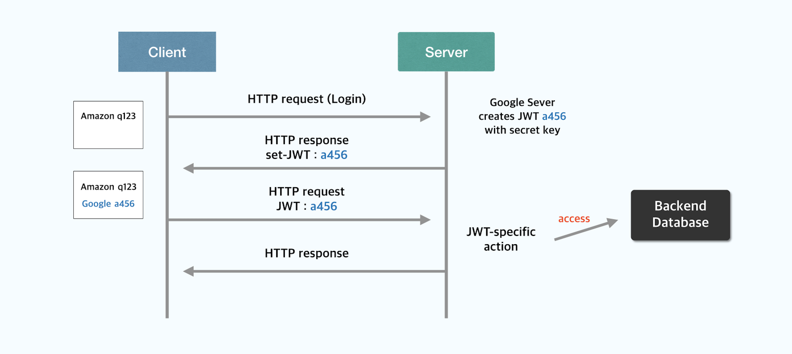

# 인가 
<b class='post-subtitle'>Authorization</b>
> request를 실행할 수 있는 권한이 있는 유저인지 확인하는 절차

HTTP는 ```stateless protocol```에 속합니다. 프로토콜이 상태 정보를 저장할 경우 매우 복잡해지고 overhead가 발생할 수 있어 stateless protocol에서 서버는 클라이언트의 상태 정보를 유지하지 않습니다. 하지만 웹 서비스를 개발하다 보면 여러 요청에 대한 이전 상태의 정보가 필요한 경우가 있습니다. 예를 들어 최초 로그인 이후에도 로그인 인증 정보가 유지되어 새로운 유저가 아닌 로그인된 유저로 인식되도록 하거나 유저마다 다른 정보를 제공하기 위해 트래킹하는 등의 stateful 한 통신이 필요합니다. 이러한 기능을 위해 세션, 쿠키 또는 웹 스토리지를 활용하여 상태 정보를 저장하고 서버가 클라이언트를 판별할 수 있도록 합니다.  

<br>

## 세션 기반 인증

1. 로그인
2. 서버는 유저 정보 확인 후 세션 ID 생성 후 세션 저장소에 저장
3. 서버는 세션 ID를 쿠키 형태로 전송
4. 클라이언트는 세션 ID를 브라우저에 저장
5. 클라이언트는 세션 ID를 HTTP 요청과 함께 전송
6. 서버는 세션 ID를 통해 유저 정보 확인
7. HTTP 응답  

세션 기반 인증 방식에서 브라우저에는 유저에 해당하는 세션 ID만을 저장하고 개인 정보 등은 저장하지 않습니다. 서버의 세션에는 로그인 상태, 마지막 로그인 시간, 만료 기한 등의 정보를 저장합니다.

<br>

### 세션 기반 인증 방식의 장단점
- 장점
    - 서버에서 데이터를 관리하기 때문에 상대적으로 안전  
    
- 단점
    - 세션 ID를 모든 서버에서 접근 할 수 있도록 하기 위해 redis와 같은 중앙 세션 저장소가 필요
    - 다중 서버일 때 중앙 세션 관리 시스템이 필요하며 만약 중앙 세션 관리 시스템에서 장애가 일어나면 시스템 전체에 문제가 발생

<br>

## 토큰 기반 인증

1. 로그인
2. 서버는 유저의 정보를 secret key를 사용하여 JWT 생성
3. 서버는 생성한 JWT를 클라이언트로 전송
4. 클라이언트는 JWT를 브라우저에 저장
5. 클라이언트는 JWT를 HTTP 요청과 함께 전송
6. 서버는 secret key를 사용하여 토큰을 decode하고 데이터베이스에서 유저의 권한을 확인
7. HTTP 응답

<br>

### 토큰 기반 인증 방식의 장단점
- 장점
    - 추가 저장소가 필요 없어 서버를 확장하기에 유리
- 단점
    - 토큰의 payload 부분을 decode하여 사용자의 개인 정보를 탈취할 수 있어 보안 측면에서 세션 인증 방식보다 위험
    - 이미 발급된 토큰은 유효기간이 만료될 때 까지 삭제 불가능

<br>

# JWT
JWT<l style='font-size:14px; color:#aaa'>(JSON Web Token)</l>는 ```access token```을 만드는 방법 중 하나입니다.  
유저가 누구인지 식별 할 수 있는 정보를 토큰에 저장해 클라이언트가 가지고 있습니다.

JWT의 구조는 다음과 같습니다.
- **header** : 암호화 알고리즘 정보와 토큰의 타입에 대한 정보가 담겨있습니다.
- **payload** : 유저의 인증 정보, 최소한의 필요한 정보만 담겨있어야 합니다.
- **signature** : header와 payload를 Base64 인코딩하여 (.) 구분자로 연결시킵니다. 그리고 지정한 암호화 알고리즘과 secret key를 사용하여 암호화를 합니다. 
이 후 토큰을 탈취하여 payload의 내용을 변경하더라도 변경되기 전의 payload 데이터로 signature에 암호화해두었기 때문에 토큰의 위변조를 감지할 수 있습니다.  

JWT의 결과 값은 버전에 따라 ```bytes``` 타입(ver. 1.7) 또는 ```str``` 타입(ver. 2.0 이상)입니다.  


```py
access_token = jwt.encode({'email': user.email}, secret_key['SECRET_KEY'], algorithm = ALGORITHM).decode('utf-8')
```
encode 결과에 따라 bytes를 str 타입으로 바꿔줍니다. 
위에서 발급한 access token은 프론트엔드에게 전달하고 프론트엔드에서는 사용자 정보가 필요한 API를 호출할 때 access token을 함께 보냅니다.

```py
access_token = request.headers.get('Authorization', None)
payload = jwt.decode(access_token, secret_key['SECRET_KEY'], algorithm = ALGORITHM)
```
여기서 payload의 값은 token을 만들 때 넘겨주었던 ```{'email': user.email}```입니다.


---
왜 세션 아이디는 쿠키에 저장 토큰은 로컬.ㅐ[[]]
쿠키는 httponly 옵션이 존재해서 xss공격을 방지할 수 있다. 
로컬 스토리지는 Js로 접근 가능
세션 아이디는 httponlny secure 쿠키에 저장되어야 한다. 
xss js 대입해 탈취
csrf 인증된 사용자의 행위를 할 수 있음
로컬 스토리지는 사용자가 삭제하기 전까지 삭제되지 않음
토큰은 서버로부터 전달받은 데이터를 저장하고 전달하는 것을 목적으로 함
로컬스토리지는 페이지에서 일어나는 상태나 데이터를 목적으로 함