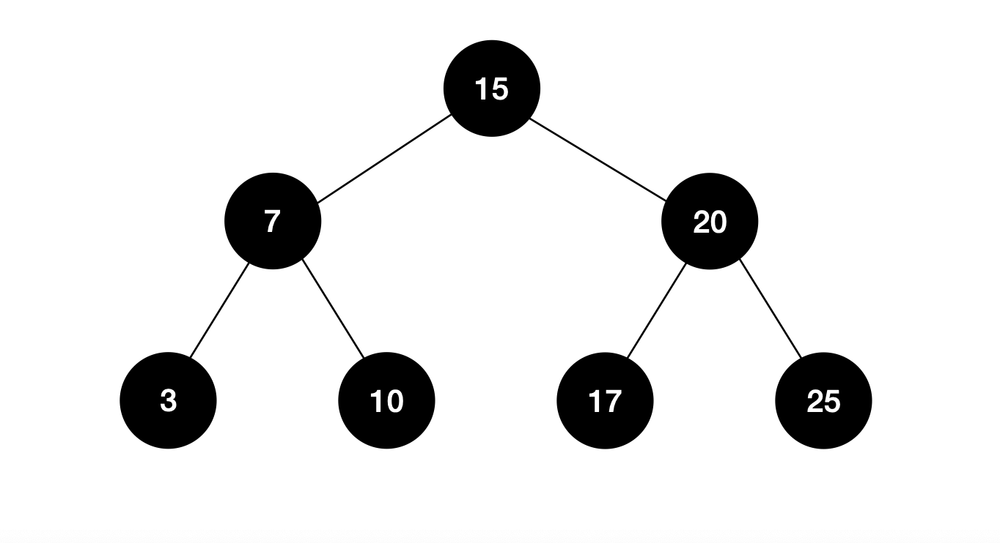
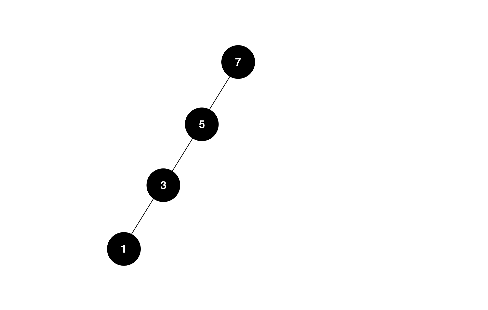
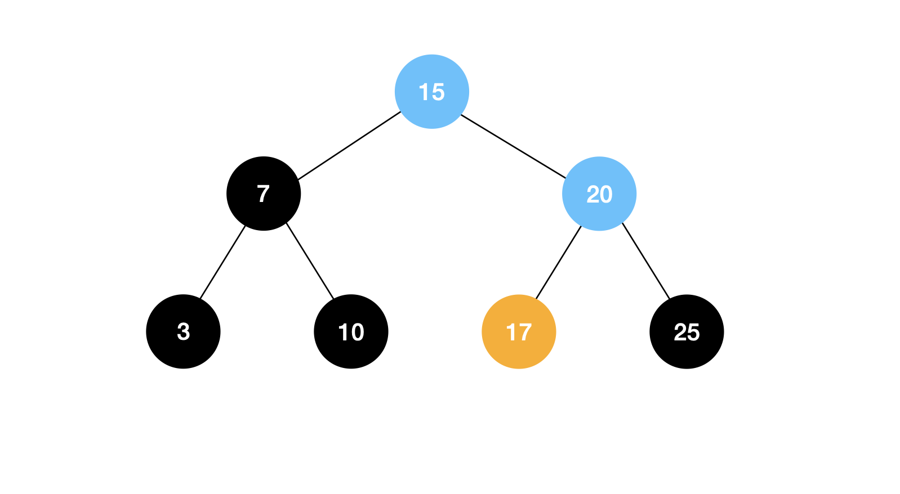
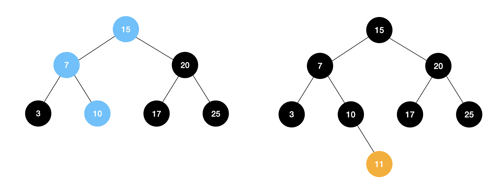
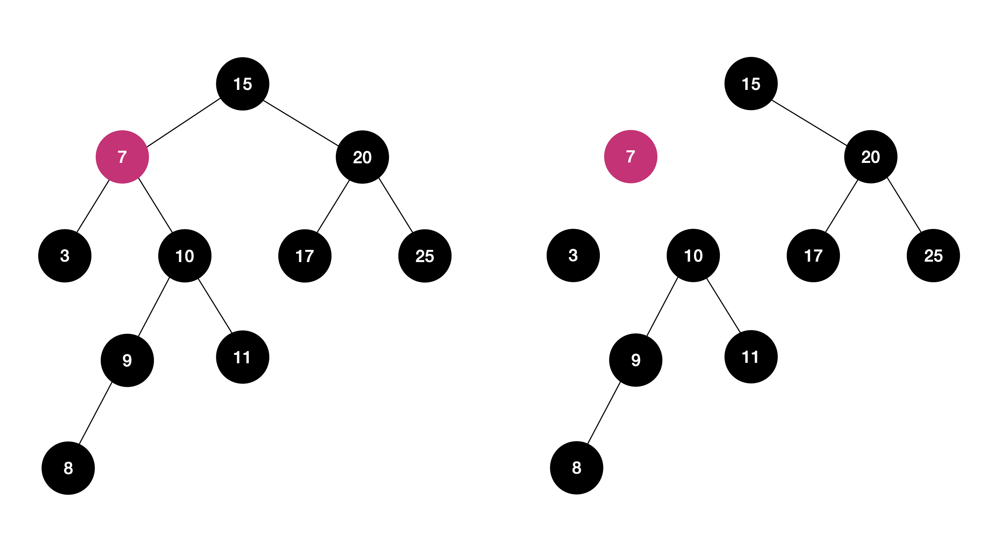
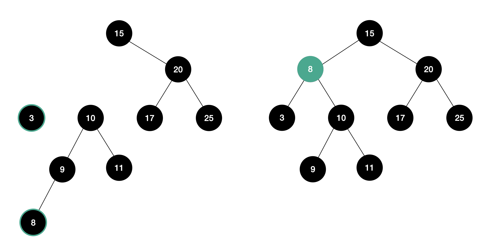

# Binary Search Tree
## Binary Tree
이진 트리는 하위 노드를 최대 2 개를 가지고 있는 트리를 말합니다.

## Binary Seach Tree
이진 탐색 트리는 이진 트리에 몇 가지 조건이 추가 된 트리입니다.
- 노드의 왼쪽 하위 트리에는 자신보다 값이 작은 노드만 존재합니다.
- 노드의 오른쪽 하위 트리에는 자신보다 값이 큰 노드만 존재합니다.



### 탐색

- 이진 탐색 트리는 정렬이 되어있다는 조건이 있기 때문에 쉽게 원하는 키를 탐색할 수 있습니다. 
- 균형잡힌 트리라면 O(logN)의 시간이 걸리지만 위처럼 불균형하다면 O(N)의 시간이 걸릴 수 있어 최적화 과정이 필요할 수 있습니다. 


1. 루트 노드의 key인 15와 탐색하길 원하는 key인 15와 크기를 비교 (15 < 17)
2. 17이 15보다 크기 때문에 루트 노드의 오른쪽 하위 노드의 키를 비교 (20 > 17)
3. 17이 20보다 작기 때문에 노드의 왼쪽 하위 노드의 key와 비교 (17 == 17)
4. 노드의 key와 탐색 목표 key인 17이 같기 때문에 탐색 종료

### 삽입

1. 루트 노드의 key인 15와 삽입하길 원하는 key인 11을 크기를 비교 (15 > 11)
2. 11이 15보다 작기 떄문에 루트 노드의 왼쪽 하위 노드의 키를 비교 (7 > 11)
3. 11이 7보다 크기 때문에 노드의 오른쪽 하위 노드의 key와 비교 (10 < 11)
4. 11이 10보다 크기 때문에 노드의 오른쪽 하위 노드에 삽입

### 삭제

1. 삭제를 원하는 노드의 key를 탐색
2. 삭제 노드와 연결된 상위 노드와 하위 노드와의 연결을 해제

3. 메모리에서 노드를 삭제
3. 삭제 노드와 대체할 노드를 선택
    - 7은 위 트리에서 2번째로 작은 수입니다. 따라서 7이 삭제된다면 이 자리에 1번째로 작은 수인 3과 3번째로 작은 수인 8이 올 수 있습니다. 이 예시에서는 8을 선택하였습니다.
    - 대체할 노드는 삭제 노드의 왼쪽 하위 노드의 가장 오른쪽 하위 노드 또는 오른쪽 하위 노드의 가장 왼쪽 하위 노드를 선택하면 됩니다.
4. 대체 노드가 삭제 노드를 대체하고 상위 노드와 하위 노드와 연결
    - 구현 시 노드의 연결을 해제하고 다시 연결해주는 과정을 생략하고 7과 8인 서로의 key 값 바꾸어 주면 쉽게 구현할 수 있습니다.
    

### 구현
```py
class Node:
    def __init__(self, value):
        self.value = value
        self.left = None
        self.right = None

class BinarySearchTree:
    def __init__(self):
        self.root = None

    def in_order_traverse(self, node):
        if not node:
            return
        self.in_order_traverse(node.left)
        print(node.value, end=' ')
        self.in_order_traverse(node.right)

    def insert(self, value):
        if self.root:
            next_node = self.root

            while True:
                if next_node.value <= value:
                    if next_node.right:
                        next_node = next_node.right
                    else:
                        next_node.right = Node(value)
                        return
                elif next_node.value > value:
                    if next_node.left:
                        next_node = next_node.left
                    else:
                        next_node.left = Node(value)
                        return
                
        else:
            self.root = Node(value)

    def search(self, value):
        return

    def delete(self, value):
        if not self.root:
            print('삭제할 노드가 없음')
            return

        curr_node = self.root
        delete_node = None
        parent_node = None

        # 탐색
        while True:
            if not curr_node:
                print('삭제할 노드가 없음')
                return

            if curr_node.value == value:
                delete_node = curr_node
                break
            elif curr_node.value < value:
                parent_node = curr_node
                curr_node = curr_node.right
            else:
                parent_node = curr_node
                curr_node = curr_node.left

        # 삭제
        # delete_node에 하위 노드가 없는 경우
        if not delete_node.left and not delete_node.right:
            # delete_node가 최상위 노드일 경우
            if not parent_node:
                self.root = None
            
            # 데이터가 부모 노드의 값보다 클 경우
            elif parent_node.value > value:
                parent_node.left = None
            
            # 데이터가 부모 노드의 값보다 클 경우
            else:
                parent_node.right = None
            
            del delete_node
        
        # delete_node에 하위 노드가 존재하는 경우
        else:
            # 오른쪽 하위 노드가 존재할 경우
            if not delete_node.left and delete_node.right:
                if not parent_node:
                    self.root = delete_node.right
                elif parent_node.value > value:
                    parent_node.left = delete_node.right
                else:
                    parent_node.right = delete_node.right
                del delete_node
            
            # 왼쪽 하위 노드가 존재할 경우
            elif not delete_node.right and delete_node.left:
                if not parent_node:
                    self.root = delete_node.left
                elif parent_node.value > value:
                    parent_node.left = delete_node.left
                else:
                    parent_node.right = delete_node.left
                
                del delete_node
            
            # 둘 다 존재할 경우
            else:
                change_node = delete_node.right

                # delete_node의 자리는 오른쪽 서브 트리의 가장 왼쪽에 있는 하위 노드로 대체함.
                # delete_node의 오른쪽 하위 노드의 왼쪽 하위 노드가 없을 경우 그대로 오른쪽 하위 노드가 change_node가 됨.
                if not change_node.left:
                    delete_node.value = change_node.value
                    delete_node.right = change_node.right
                else:
                    parent_change_node = None

                    # 대체할 노드를 탐색
                    while change_node.left:
                        parent_change_node = change_node
                        change_node = change_node.left
                    
                    delete_node.value = change_node.value
                    parent_change_node.left = change_node.right
                
                del change_node


import random

bst = BinarySearchTree()
nums = []

for i in range(1, 100):
    random_num = random.randint(1, 100)
    nums.append(random_num)
    bst.insert(random_num)

bst.in_order_traverse(bst.root)
print('')

for n in range(len(nums)):
    random_num = random.choice(nums)
    bst.delete(random_num)
    nums.remove(random_num)

bst.in_order_traverse(bst.root)
```