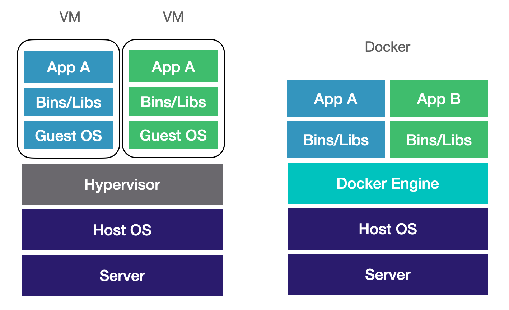
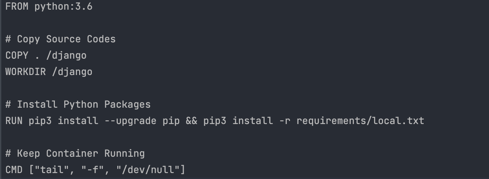
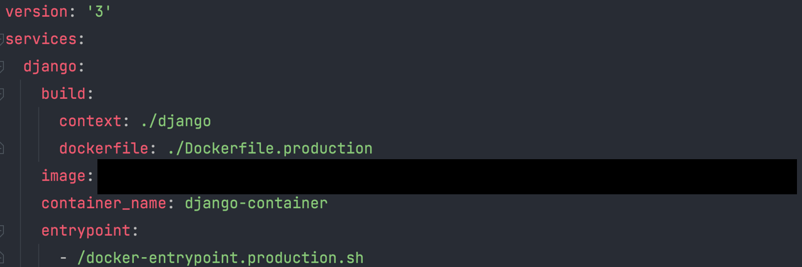

# Docker
도커는 어플리케이션을 구동하는 데 필요한 다양한 환경을 쉽게 구성해주는 오픈 소스 프로그램입니다.  

새로운 PC에 처음 개발 환경 세팅을 해야 할 때면 어플리케이션을 위한 가상 환경, Python, 데이터베이스 등을 일일이 설치하는 귀찮은 작업을 해야 했습니다. 그 과정에서 필요한 소프트웨어를 다른 버전으로 설치하여 다른 PC에서는 작동하지만 내 PC에서만 작동하지 않는 문제가 발생한 적도 있고 이런 문제들을 해결하다 보면 개발 환경 구축을 위해 하루가 넘는 시간을 투자하는 일이 빈번했습니다. 하지만 도커를 사용한다면 이러한 귀찮은 작업은 컨테이너를 통해 쉽게 해결할 수 있습니다. 

도커는 구성 환경을 똑같이 복제해 개발 환경 구축과 배포를 쉽게 할 수 있도록 도와줍니다. 어플리케이션에 필요한 리소스, 환경 변수 등을 이미지에 정의해두고 올려두면 다른 PC, 원격 클라우드에서 이미지를 가져와 컨테이너를 만들어 아주 쉽게 개발 환경을 구축 및 배포를 할 수 있고 버전을 바꾸거나 새로운 환경이 필요할 때 이미지만 수정하면 되기 때문에 모든 개발자가 어렵고 귀찮은 작업을 하지 않아도 된다는 장점이 있습니다.  



도커가 기존의 가상화 방식인 VM<l style='font-size:14px; color:#aaa'>(Virtual Machine)</l>과 다른 점은 VM은 OS를 가상화하여 호스트 OS 위에서 게스트 OS를 가상화 하는 방식이고 도커는 호스트의 OS를 공유하며 프로세스를 격리된 공간에서 동작시키는 다는 점입니다. 이때 OS를 가상화 하는 방식은 너무 무겁다는 단점이 있으며 호스트 OS의 리소스를 많이 사용한다는 성능 상의 문제가 있습니다. 

도커는 프로세스를 가상화하는 방식으로 가볍고 빠르게 동작합니다. 프로세스를 격리하는 방식은 Container Engine 소프트웨어를 통해 개별적인 컨테이너를 고립된 환경에서 구동할 수 있도록 해주며 컨테이너는 각자 OS를 포함하지 않고 호스트의 OS를 공유하도록 합니다. 도커는 앞에서 언급한 Container Engine 중 하나입니다.

도커는 리눅스 컨테이너를 기반으로 하며 리눅스 컨테이너를 지원하지 않는 Windows 또는 Mac OS의 경우 경량 가상머신이 중간에서 사용됩니다.

## Docker의 구성 요소

### Image
이미지는 컨테이너를 생성하기 위해 필요한 모든 파일과 설정 값 등을 가지고 있는 파일입니다. 이미지는 변하지 않으며 여러 개의 컨테이너를 생성할 수 있습니다.
또한, 이미지는 DockerHub에서 버전 관리 및 배포가 가능합니다.

#### DockerFile

도커 파일은 이미지를 구성하는데 필요한 패키지, 소스코드 등을 기록하고 이를 빌드하여 이미지를 생성할 수 있도록 해주는 파일이며 실제로 컨테이너 서버에 들어가서 명령어를 입력하고 커밋하는 과정을 파일로 관리할 수 있도록 해줍니다. 위 예시로 든 도커 파일은 ```python3.6``` 이미지로 접속해서 아래의 명령어를 순서대로 입력하여 설치하는 것과 같습니다. 위처럼 직접 컨테이너에서 작업하는 것보다 도커 파일로 관리하는 것이 좀 더 권장됩니다. 만약 파일로 관리하지 않는다면 프로그램 설치의 과정과 히스토리는 최초의 설치자만 알 수 있어 버전 관리가 힘들어지는데 이 과정을 도커 파일로 관리하여 이를 개선하고 쉽게 배포가 가능해집니다.

### Container

```
docker run [OPTIONS] IMAGE [COMMAND] [ARG...]
```
컨테이너는 이미지를 실행한 상태를 말합니다. 위 명령어를 입력하여 컨테이너를 실행할 수 있고 컨테이너는 격리된 공간에서 프로세스가 동작하게 됩니다.
컨테이너를 종료하면 삭제되는 것이 아니라 메모리에 남아있어 다시 실행할 수 있고, 컨테이너를 삭제하게 되면 컨테이너에서 생성된 모든 파일이 삭제됩니다.

### Volume vs Bind mounts
도커를 사용하여 개발을 할 때 가상의 파일 시스템과 호스트의 파일 시스템을 연결하여 계속해서 변하는 코드가 컨테이너에도 반영되기를 바라거나 컨테이너의 생명 주기와 관계없이 데이터를 영속적으로 저장하고 싶은 경우가 있을 것 입니다. 도커는 이를 위해 두 가지 방법을 제공합니다.

#### Volume
```
docker run -v 볼륨 이름:컨테이너의 볼륨 경로 django-container
```
볼륨은 도커에서 관리하는 저장 공간입니다. 컨테이너에서 볼륨을 사용하기 위해서는 볼륨을 생성하고 컨테이너에 마운트 해주어야 합니다. 
사용자가 직접 ```docker volume create``` 명령어로 만들거나 컨테이너, 서비스 생성 중 도커가 디폴트 볼륨을 생성하기도 합니다.
볼륨은 실행 옵션에서 ```--volumes-from``` 명령어를 통해 여러 개의 컨테이너와 연결하여 컨테이너 사이에서 파일을 공유할 수 있습니다. 마운트 되어 있지 않은 볼륨은  ```docker volume prune``` 명령어로 삭제할 수 있습니다.

#### Bind mounts
```
docker run -v host의 파일 시스템 경로:컨테이너의 볼륨 경로 django-container
```
bind mounts는 호스트의 파일 또는 디렉토리를 ```-v``` 옵션에 작성합니다.  

볼륨과 bind mounts 두 옵션은 몇 가지 차이점이 있습니다. 볼륨은 ```/var/lib/docker/volumes/<volume-name>``` 경로에 저장되는 반면, bind mounts는 호스트의 파일 시스템 어디든 위치할 수 있습니다. 그리고 위에서 언급했듯이 볼륨은 직접 생성하고 삭제해주어야 하지만 도커가 직접 관리를 해주는 이점이 있습니다. 로컬에서 개발하는 경우에는 작업을 하고 있는 디렉토리를 컨테이너에 mount 하여 변동 사항을 컨테이너에 실시간으로 반영할 수 있어 bind mounts가 더 편리할 것입니다.


## Docker-compose
웹 어플리케이션을 동작시키기 위해서는 웹 서버와 데이터베이스 등이 필요합니다. 따라서 웹 서버와 데이터베이스의 이미지를 정의하고 컨테이너를 실행시켜야 하는데 각각의 컨테이너를 ```docker run``` 명령어를 통해 실행시킬 수 있습니다. 하지만 이렇게 매번 컨테이너를 실행시키거나 명령어에 포함된 옵션이 많을 경우 굉장히 번거로울 것입니다. 이럴 때 docker compose를 사용하여 명령어를 정의하고 컨테이너 간의 의존 관계를 설정하여 좀 더 편리하게 어플리케이션을 동작시킬 수 있습니다.

### docker-compose.yml

```
docker-compose up -d
```
docker compose 파일에서는 ```docker run``` 명령어에 설정할 수 있는 모든 옵션과 컨테이너의 볼륨과 의존성을 정의할 수 있습니다. ```docker-compose.yml```파일을 기본 설정 파일로 사용하고 이름을 바꿀 경우엔 명시 해주어야 합니다. 

