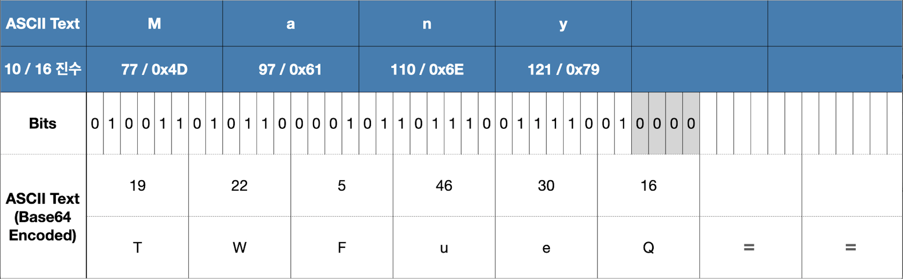

# 인코딩
<b class='post-subtitle'>Encoding</b>
> 파일에 저장된 정보의 형태를 다른 것으로 변경하는 것을 말합니다. 사람이 인지하는 형태의 데이터를 컴퓨터가 이해할 수 있는 0과 1로 변환하는 과정을 통틀어서 말하고 표준화, 처리 속도 향상, 저장 공간 절약을 위해서 인코딩을 합니다.

## Text Encoding 
텍스트를 바이너리 형태로 나타내기 위해 약속한 규격을 말합니다.

### ASCII (American Standard Cord for Information Interchange)
영문자를 표현하기 위한 인코딩 방식이며 1바이트 중 7비트를 사용하여 128가지의 문자를 표현합니다. 영문자만을 표현하기 위해 만들어졌기 때문에 2바이트 이상의 코드를 표현할 수 없어 다른 국가의 언어들은 표현할 수 없습니다. 이후 더 많은 언어를 표현할 수 있는 문자표인 유니코드가 등장하게 되었습니다. 

### Unicode 
유니코드는 세계의 모든 언어와 기호에 부여한 코드 값의 집합입니다. ASCII 코드에서 'A'는 ```0x41```이고 유니코드에서는  ```U+``` 접두어가 붙어 ```U+0041```이 됩니다. 여기서 헷갈릴 수 있지만, 유니코드와 유니코드 인코딩은 다른 개념입니다. 유니코드는 'A'라는 문자를 65라는 숫자에 배당하는 것을 의미하며 유니코드 인코딩이란 65라는 숫자를 컴퓨터에 저장하기 위하여 2진수로 저장할 때 자릿수를 달리하거나 가변 정보를 넣어 저장하는 등의 논리와 방식을 결정하는 것이 유니코드 인코딩이라고 할 수 있습니다.[^1]

### UTF (Unicode Transformation Format)
유니코드 인코딩에는 UTF-8, UTF-16, UTF-32 등이 존재합니다. 각자 유니코드를 표현하는 방식이 조금씩 다른데 UTF-8은 가변 바이트를 사용하고 UTF-16은 2바이트, UTF-32는 4바이트로 고정하여 유니코드를 저장합니다. UTF-16과 같이 고정 바이트로 문자를 표현하게 되면 1바이트로 표현할 수 있는 문자도 고정 2바이트로 표현하기 때문에 오히려 크기가 커지게 되어 비효율적입니다. UTF-8은 최대 6바이트까지 표현 할 수 있지만 다른 인코딩과의 호환을 위해 4바이트까지만 사용하며 1바이트 영역은 ASCII 코드와 하위 호환성을 가지게 됩니다. 따라서 필요한 만큼만 바이트를 사용할 수 있으며 ASCII 코드와의 호환성 등을 이유로 UTF-8이 널리 사용되게 됩니다.[^2]

#### UTF-8
UTF-8 방식은 가변 바이트를 사용하며 ASCII 코드에 해당하는 0번부터 127번까지의 문자인 공백 및 영문은 1바이트로 표현 할 수 있고 코드 값 128 ~ 2,047번까지는 2바이트를 사용합니다. 한글의 경우 한글 자모와 완성형 한글 모두 UTF-8에서는 3바이트로 표현됩니다. 예를 들어, 2바이트를 표현하기 위해서는 가장 앞에 0 대신 1을 씁니다. 그리고 1을 더 써서 1개의 바이트가 추가로 온다고 선언하고 마지막으로 0을 쓰면 첫 3비트는 110이 되고 남은 비트로 인코딩을 합니다. 두 번째 바이트에는 10으로 시작하여 후속 바이트라는 것을 명시합니다. 추가적이 바이트는 아래 표와 같이 표현합니다. 


*출처 [namu.wiki](https://namu.wiki/w/UTF-8)*

'한'이라는 문자는 유니코드 상 ```0xD55C```로 표현할 수 있고 2진수로 표현하면 ```1101010101011100```이 되어 16비트를 모두 사용하게 됩니다. 이를 인코딩하면 **1110**1101 **10**010101 **10**011100 → ```0xED 0x95 0x9C``` 가 되어 3바이트를 사용하게 됩니다. 

### EUC-KR, CP949 (MS949)
두 가지 모두 한글 인코딩 방식으로 2바이트로 한글을 표현합니다. EUC-KR 인코딩은 한글에서 자주 사용하는 2350자만을 추려내어 지원합니다. 따라서 표현하지 못하는 글자들이 생겨나게 되었고 이를 보완하기 위하여 확장 완성형인 CP949 인코딩이 개발되었습니다. CP949 인코딩은 마이크로소프트가 제정한 규격으로 MS949라고도 불립니다. 11,172자의 한글을 표현할 수 있어 EUC-KR에서 표현하지 못하는 글자들을 보완할 수 있지만 가나다 순 정렬을 구현할 수 없다는 단점이 있습니다. 

## Base64 Encoding
Base64 인코딩이란 바이너리 데이터를 ASCII 문자열로 바꾸는 인코딩 방식을 말합니다.
Base64 인코딩은 6비트 단위로 수행되기 때문에 6과 8의 최소 공배수인 <b>24비트</b> 만큼의 버퍼를 생성하여 24비트를 채우고 6비트 단위로 잘라 ASCII 문자로 변환합니다.[^3] 

- 원본 문자열 → ASCII binary → 6비트로 cut → 10진수 변환 → Base64 변환

  

'Many'라는 문자열을 이진화하여 6비트씩 버퍼에 채워넣었을 때 남는 비트가 있다면 패딩 비트 0을 채워 6비트로 만듭니다. 그리고 24비트 버퍼에 남아있는 부분이 있다면 채워지지 않은 문자열 개수를 나타내는 '=' 패딩 문자를 추가하여 ```TWFueQ==```가 됩니다.

[^1]: [namu.wiki](https://namu.wiki/w/%EC%9C%A0%EB%8B%88%EC%BD%94%EB%93%9C?from=unicode) 참고
[^2]: [namu.wiki](https://namu.wiki/w/UTF-8) 참고
[^3]: [devuna](https://devuna.tistory.com/41) 참고