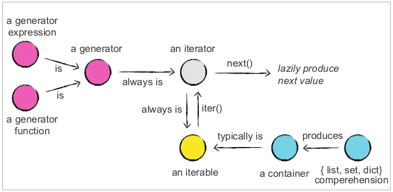

# Iterator 
## Iterable 객체
- iterable 객체는 값을 순차적으로 꺼내올 수 있는 객체를 말합니다. 
- iterator를 생성하는 기능을 가지고 있습니다. 
- 리스트, 딕셔너리와 같이 for 루프를 돌릴 수 있다면 iterable 객체입니다.
- ```__iter__()```함수가 있다면 iterable 객체라고 할 수 있습니다. 

## Iterator 객체
iterator 객체가 되기 위해서는 아래의 두 가지의 메소드를 구현해야 합니다.  
- ```__iter__()```: iterator(iterable 객체 자신 또는 별도 클래스의 객체)를 반환
- ```__next__()```: 다음 값을 반환하며 더 이상 다음 값이 없으면 ```StopIteration```예외를 발생  

 ```__next__()```를 가지고 있다면 모두 iterator 객체이며  ```__next__()``` 함수를 호출하면 for 문이 동작하는 것처럼 다음 값을 하나씩 꺼내올 수 있습니다. 다음과 같이 작성하면,
```py
mylist = [1, 2, 3]
for item in mylist:
    pass
```
 위 코드를 디스 어셈블링해보면 ```iter()```를 실행시키는데 필요한 ```GET_ITER```를 호출하고 ```FOR_ITER```를 통해 ```next()```를 호출하는 것처럼 반복적으로 값을 가져오고 있다는 것을 알 수 있습니다. [^1]
```
>>> import dis
>>> mylist = [1, 2, 3]
>>> dis.dis('for _ in mylist: pass')
  1           0 LOAD_NAME                0 (mylist)
              2 GET_ITER
        >>    4 FOR_ITER                 4 (to 10)
              6 STORE_NAME               1 (_)
              8 JUMP_ABSOLUTE            4
        >>   10 LOAD_CONST               0 (None)
             12 RETURN_VALUE
```

# Generator
generator는 iterator이며 차이는 ```__next__()```의 반환 값이 ```yield``` 값으로 대체된다는 것입니다. ```yield```를 사용하면 함수는 generator가 되고 호출하면 generator 객체가 반환됩니다. 리스트, 딕셔너리와 같은 iterable한 객체들은 모든 값을 메모리가 가지고 있어야 하지만 generator의 경우 필요할 때만 ```yield```로 가져와 사용하기 때문에 모든 값을 메모리에 올려둘 필요가 없게 되어 메모리/CPU 효율이 더 좋습니다.[^2]

iterator 객체의 경우 ```iter()```를 통해 자기 자신을 반환하기 때문에 for 문을 돌린 후 한 번 더 for 문을 돌리는 것은 불가능합니다. 하지만 iterable 객체의 경우에는 ```iter()```를 통해 새로운 iterator 객체를 반환하기 때문에 계속해서 반복할 수 있습니다.


*출처 [nvie.com](https://nvie.com/posts/iterators-vs-generators/)*

```enumerate()```, ```zip()```또한 iterator를 반환해주는 generator입니다.
```py
def enumerate(sequence, start=0):
    n = start
    for elem in sequence:
        yield n, elem
        n += 1
```
## yield
python에서 보통의 함수는 값을 반환하면 종료됩니다. 하지만 generator는 ```yield``` 키워드를 통해 조금 다른 동작을 하게 됩니다.
```py
def generator_squares():
    for i in range(3):
        yield i ** 2
print("gen object={}".format(generator_squares())  # gen object=<generator object generator_squares at 0x10f3b0150>
```
```yield```를 만났을 때 처리를 중단하고 모든 local state(변수의 상태, 명령어 포인터, 내부 스택, 예외 처리 상태)가 유지됩니다. 그러고 나서 제어권을 상위 context로 양보하고 ```__next__()```가 호출되면 다시 중단된 시점부터 시작하게 됩니다.

## send
```__next__()```함수로 generator를 호출할 경우 None을 전달하게 되고 ```send()```함수를 통해 외부에서 원하는 값을 generator로 전달할 수 있습니다.
```py
def generator_send():
    while True:
        received_value = yield
        print("received_value = {}".format(received_value))
        yield received_value * 2

gen = generator_send()
next(gen)
print(gen.send(2))
next(gen)
print(gen.send(3))
```

## generator expression
python에는 두 가지 타입이 존재합니다. 
- generator 함수
- generator 표현식  

지금까지는 generator 함수에 대해 얘기했고 또 다른 타입은 generator 표현식입니다.

```py
>>> lazy_squares = (x * x for x in numbers)
>>> lazy_squares
<generator object <genexpr> at 0x10d1f5510>
>>> next(lazy_squares)
1
>>> list(lazy_squares)
[4, 9, 16, 25, 36]
```
list comprehension과는 달리 데이터 전체를 반환하지 않고 generator 표현식을 반환합니다. 따라서 필요할 때만 값을 반환받을 수 있고 메모리를 효율적으로 사용할 수 있습니다. 위처럼 ```next()```로 generator의 첫 번째 값을 읽은 후에는 상태가 두 번째 요소에 있고 ```list()```를 통해 전체 값을 받아올 때는 두 번째 값부터 반환하게 됩니다.
 
[^1]: [nvie.com](https://nvie.com/posts/iterators-vs-generators/) 참고
[^2]: [winterjung Blog](https://blog.winterjung.dev/2018/02/13/python-generator) 참고