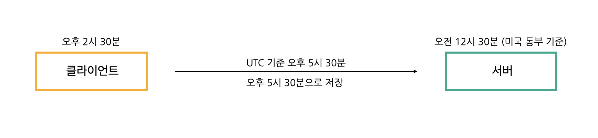

프로젝트를 진행하며 시간과 관련된 내용을 개발하다 보면 자주 등장하지만 헷갈려 실수하기 쉬운 것들이 있습니다. 날짜를 저장하고 보여줄 때 내가 예상한 것과는 다르게 저장되고 보이는 경우가 있는데 사소하지만, 꼭 기억해야 할 내용이라 포스팅하려고 합니다.

우리가 개발하는 이곳은 한국이고 서버는 미국에 있다면 클라이언트는 한국 시간대을 기준으로, 서버는 미국 시간대를 기준으로 요청하고 저장합니다. 이러다 보니 문제가 발생하게 되고 이러한 문제를 해결하기 위해 국제 표준 시간인 UTC를 사용하기로 약속합니다.



시간을 저장할 땐 현재 시각을 UTC 기준으로 변환해 저장하고 시간을 조회해야 할 때는 한국 시각으로 바꿔서 보여줍니다.

## TIME_ZONE / USE_TZ
날짜 자료형 필드는 settings에 설정한 내용에 영향을 받는데 두 가지의 옵션이 있습니다.

```py
# settings.py

TIME_ZONE = 'Asia/Seoul'
USE_TZ = True
```

- TIME_ZONE
    - 현재 프로젝트에 적용되는 시간대를 설정합니다.
    - 한국 시간대는 TIME_ZONE = '**Asia/Seoul**' (UTC+9:00)
- USE_TZ
    - False: 장고는 내부적으로 Naive datetime 객체를 사용하며 datetime을 저장 할 때 timezone이 사용
    - True: 장고는 내부적으로 Aware datetime 객체를 사용하며 form과 template에 timezone이 적용

## timezone / datetime
Django에서 datetime 객체를 생성하는 패키지는 두 가지가 있는데 위와 같이 TIME_ZONE 값으로 시간을 변환하는 방식을 사용한다고 설정할 경우, 파이썬의 datetime이 아닌 장고의 timezone 객체를 사용해야 합니다. timezone을 사용해서 생성하지 않거나 tzinfo의 설정 없이 datetime을 사용하면 경고가 나타납니다. 서버가 한국에 있고 서비스가 한국에서만 사용될 예정이라면 USE_TZ = False로 설정하고 datetime 객체를 사용할 수 있습니다.
- Python의 내장 모듈인 datetime
- Django의 utils 모듈인 timezone
    - TIME_ZONE 값에 맞게 ``datetime()``, ``date()`` 객체를 생성

실무에서 timezone과 datetime을 혼동하여 사용한 코드를 정리한 적이 있는데, Aware 객체가 필요한 곳에 Naive 객체를 사용한 곳이 많아 이런 곳을 모두 찾아내어 Aware 객체로 수정한 적이 있습니다. DatetimeField에는 Aware(UTC)로 저장되기 때문에 수동으로 업데이트하는 경우는 ``timezone.now()`` 사용하고 Aware 객체이더라도 문맥에 따라 UTC, 한국 시간대를 지정합니다. 예를 들어, 데이터베이스에 저장된 Aware 객체를 템플릿에 보여줄 때는 알아서 local time으로 변환되어 보이지만 csv 다운로드 등에서 데이터베이스의 time 객체를 보여줘야 할 경우에는 UTC → localtime으로 바꾸기 위해 ``timezone.localtime()``을 사용해야 합니다.
```py
timezone.now() # Aware (UTC) 결과: datetime.datetime(2021, 8, 28, 3, 31, 26, 818455, tzinfo=<UTC>)

datetime.now(pytz.UTC) # Aware(UTC)

timezone.localtime(timezone.now()) # Aware(UTC) -> Aware(TIME_ZONE) 결과: datetime.datetime(2021, 8, 28, 12, 47, 44, 827486, tzinfo=<DstTzInfo 'Asia/Seoul' KST+9:00:00 STD>)
timezone.makeaware(datetime.now()) # Naive(TIME_ZONE) -> Aware(TIME_ZONE)


# Naive -> Aware (UTC)
model_instance.datetime_field = datetime.strptime(request.POST['datetime_field'], '%Y-%m-%d %H:%M')  # AS-IS
model_instance.datetime_field = timezone.make_aware(
    datetime.strptime(request.POST['datetime_field'], '%Y-%m-%d %H:%M')
)  # TO-BE

# Naive -> Aware (UTC)
SomeModel.objects.filter(datetime_field__gte=datetime.now())  # AS-IS
SomeModel.objects.filter(datetime_field__gte=timezone.now())  # TO-BE
```